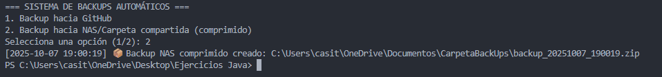
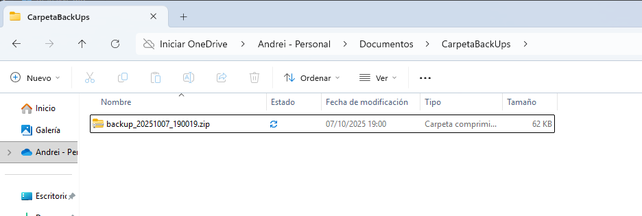
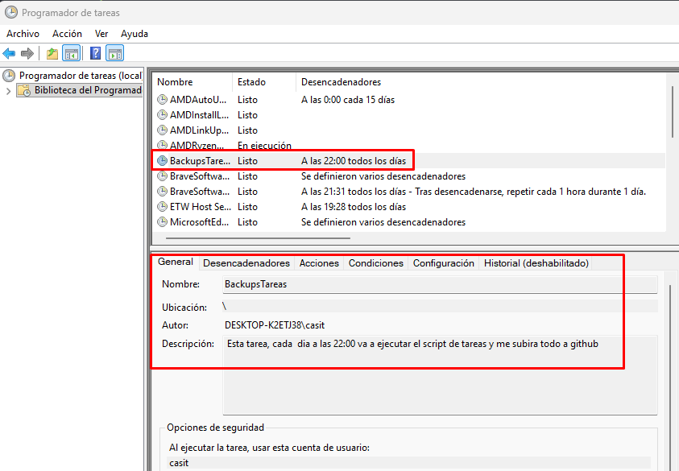
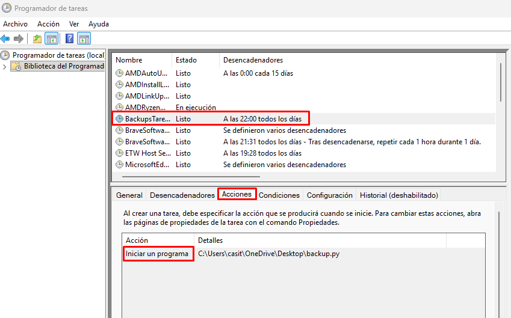
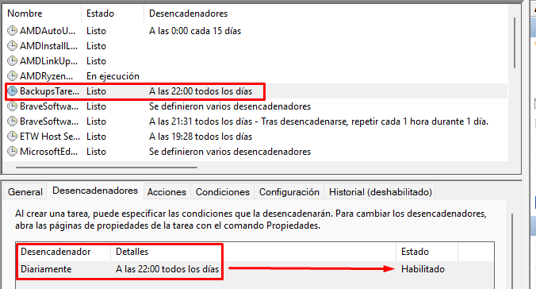
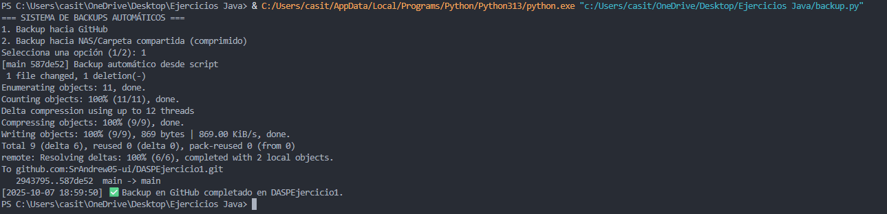

Backup Automático de Proyectos Java

¡Hola! 👋 Este proyecto es un script en Python que hace copias de seguridad automáticas de mis proyectos Java, tanto a GitHub como a una carpeta local/NAS. Así nunca pierdo nada si pasa algo con mi ordenador.

📂 Qué hace este script

**Backup a GitHub**

- Detecta si la carpeta que indiques es un repositorio Git.
- Si hay cambios nuevos, los añade, hace commit y los sube automáticamente al repo de GitHub.
- Solo sube lo que ha cambiado, así no se duplica nada.

**Backup a NAS / Carpeta local**

- Copia los proyectos a otra carpeta de tu ordenador o red.
- Solo copia archivos nuevos o modificados.
- Evita duplicados innecesarios.
- Comprime todo en un archivo `.zip` con fecha y hora.

⚙️ Requisitos previos

Para que funcione correctamente necesitas:

- Python 3 instalado.
- Git instalado y añadido al PATH.
- Tener un repositorio GitHub creado y acceso por SSH configurado.
- (Opcional) Una carpeta de red compartida o una carpeta local para el backup incremental.

🛠️ Cómo usarlo

1. Clona o descarga este proyecto en tu PC.
2. Abre el archivo `backup.py` y revisa la configuración:

```
PROJECTS_DIR = r"C:\ruta\a\tu\proyecto"          # Carpeta de tus proyectos
BACKUP_DEST = r"C:\ruta\a\la\carpeta\backup"  # Carpeta para backup incremental
GITHUB_REPO_SSH = "git@github.com:usuario/repo.git"  # Tu repo de GitHub vía SSH
COMMIT_MSG = "Backup automático desde script"       # Mensaje que se usa al subir
```

3. Ejecuta el script desde tu terminal o Visual Studio Code:

```
python backup.py
```

4. Te aparecerá un menú:

```
=== SISTEMA DE BACKUPS AUTOMÁTICOS ===
1. Backup hacia GitHub
2. Backup hacia NAS/Carpeta compartida
Selecciona una opción (1/2):
```

- Pulsa 1 para subir cambios a GitHub.
- Pulsa 2 para hacer backup a la carpeta/NAS comprimido en `.zip`.
- El script mostrará un log de lo que se está copiando o subiendo.

💡 Ejemplo de ejecución

```
=== SISTEMA DE BACKUPS AUTOMÁTICOS ===
Selecciona una opción (1/2): 1
[2025-10-07 18:06:48] ✅ Backup en GitHub completado en DASPEjercicio1.
=== SISTEMA DE BACKUPS AUTOMÁTICOS ===
Selecciona una opción (1/2): 2
[2025-10-07 22:00:00] 📦 Backup NAS comprimido creado: C:\Backup\backup_20251007_220000.zip
```

⚠️ Posibles problemas y soluciones

- **No es un repositorio Git válido**: Asegúrate de que la carpeta indicada en `PROJECTS_DIR` tenga un `.git`. Si no, inicializa Git y conecta al remoto:

```
git init
git remote add origin git@github.com:usuario/repo.git
```

- **Errores al hacer push**: Si el remoto ya tiene commits, haz primero un `git pull` antes de usar el script.
- **Archivos duplicados en NAS**: El script comprueba antes de copiar, y ahora genera un `.zip` por cada backup, evitando duplicados.

🔹 Automatización diaria

- He creado una tarea en el Programador de Tareas de Windows para que el backup se ejecute **todos los días a las 22:00**.
- Acción: ejecutar `python "C:\ruta\a\backup.py"`

- CAPTURAS DE PANTALLA DEL NAS REALIZADO CORRECTAMENTE




- CAPTURAS DE PANTALLA DE LA TAREA DE EJECUCION AUTOMATICA TODOS LOS DIAS A LAS 22:00






- CAPTURA DE PANTALLA DE QUE FUNCIONA EL SISTEMA DE PUSH AUTOMATICO


🔹 Notas finales

- El script solo sube cambios detectados, si ya subiste todo antes, dirá que no hay cambios.
- Puedes modificar `PROJECTS_DIR` y `BACKUP_DEST` para adaptarlo a tus carpetas y proyectos.
- Ahora nunca perderé mis proyectos Java, y todo está automatizado con un solo clic.

By Andrei Iordache
Fecha de entrega: 8 de Octubre 2025
